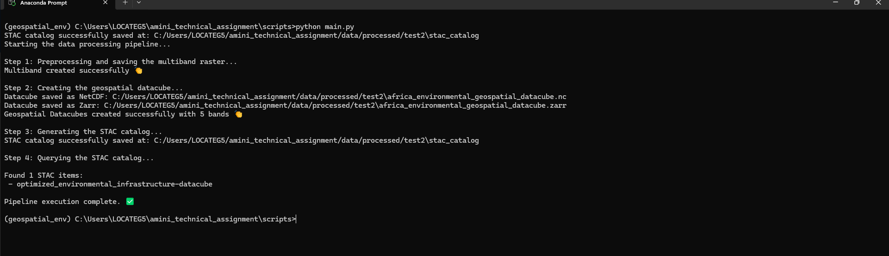

# 🌍 **Africa Environmental Datacube**


[View The Geospatial Datacube](https://drive.google.com/drive/folders/17bY5TRGLrxuMU9hKwbwlYXuThGgd_ZQ5?usp=drive_link)


## 📌 Overview

This project creates a **multi-source environmental datacube** using remote sensing data from Sentinel-1, Sentinel-2, temperature, and elevation datasets. The datacube is optimized and published as a **SpatioTemporal Asset Catalog (STAC)** to enable efficient querying and access through APIs.

---

## 💂️ Environment Setup

### **1⃣ Clone the Repository**

```bash
git clone https://github.com/Odero54/amini_technicaal_assignment.git
cd amini_technical_assignment
```

### **2⃣ Create Conda Environment** (Recommended)

```bash
conda env create -f environment.yml
conda activate geospatial_env
```

### ☆☆\*\*3⃣ Alternative: Install Using ☆☆\`\` (Only for Pip Packages)

```bash
pip install -r requirements.txt
```

---

## 👤 Project Structure

```
├── data/
│   ├── downloads/                                              # Raw datasets (Sentinel, Temperature, Elevation)
│   ├── processed/                                              # Processed datacube and STAC catalog
│       ├── africa_environmental_geospatial_datacube.zarr
        ├── africa_environmental_geospatial_datacube.nc
        ├── environmental_multiband_cog.tiff
│       ├── stac_catalog/
            ├── environmental_multiband_cog.tiff
├── notebooks/                                                     # Jupyter notebooks for step-by-step workflow
├── scripts/                                                       # Python scripts for automation
├── .gitignore                                                     # Ignore large files, cache, etc.
├── environment.yml                                                # Conda environment dependencies
├── requirements.txt                                               # Python dependencies (pip-only)
├── README.md                                                      # Documentation file
├── docs/
│   ├── geospatial_data_integration.png                            # workflow example of integrating remote sensing and Meteorological data.
```

---

## 📊 Workflow


```plaintext
+---------------------+
|  Download Data      |
| (Sentinel-1, 2,    |
| Temperature, DEM)  |
+---------+---------+
          |
          v
+---------------------+
|  Preprocess Data   |
| Resample to NDVI   |
| resolution         |
+---------+---------+
          |
          v
+---------------------+
|  Create Datacube   |
| Merge & reproject  |
| Save as Zarr/NC   |
+---------+---------+
          |
          v
+---------------------+
| Generate STAC      |
| Metadata & Assets  |
+---------+---------+
          |
          v
+---------------------+
| Publish to STAC    |
| API for Access     |
+---------------------+
```

### **1. Extract data from google earth engine or AWS using STAC API**
 - Extract Sentinel-1 (VV, VH), Sentinel-2 (NDVI - computing using NIR and Red spectral bands), temperature, and elevation.
 - Save the downloaded data sources in your local machine folder for further processing.

### **2. Preprocess Data**

- Loads Sentinel-1 (VV, VH), Sentinel-2 NDVI, temperature, and elevation data.
- Resamples all datasets to the highest resolution available (NDVI).
- Align all datasets in the same coordinate reference system (crs).
- Resamples all datasets to the highest resolution available (NDVI).
- Checking for pixel's missing data, if found fill the pixel with the data value from the nearest pixel (Interpolation).


### **2. Create and Optimize Datacube**

- Merges datasets into a **multi-band datacube**.
- Assigns CRS (EPSG:4326) and transforms it.
- Saves in **Zarr** and **NetCDF** formats.


### **3. Generate and Publish STAC Catalog**

- Converts the datacube into **STAC-compliant format**.
- Creates metadata and assets for easy API access.

📌 **Run:**

```bash
python scripts/main.py
```

### Below is the snippet example of workflow automation


---

## 🌍 Data Sources

- **Sentinel-1 (VV, VH):** Synthetic Aperture Radar (SAR) imagery.
- **Sentinel-2 NDVI:** Normalized Difference Vegetation Index (NDVI).
- **Temperature Data:** Land surface temperature dataset.
- **Elevation:** Digital Elevation Model (DEM).

---

## 🔗 STAC API Access

Once the catalog is created, you can query the STAC API using:

```bash
stac-client search --collection africa-environmental-datacube
```

Or use Python:

```python
import pystac_client
api = pystac_client.Client.open("path/to/stac_catalog/catalog.json")
items = api.search(collections=["africa-environmental-datacube"]).items()
```

---

### Importance of Saving Geospatial Datasets in Formats like **NetCDF**, **Cloud Optimized GeoTiff (COG)**, and **Zarr**

- Datasets in these formats improves the efficiency of handling geospatial data.
- Geospatial datasets in these formats are more scalable, and suitable for modern geospatial workflows.
- Standardized for Scientific Data: NetCDF is widely used in climate, oceanography, and atmospheric sciences due to its ability to store multidimensional data (e.g., time-series, 3D/4D data).
- NetCDF uses chunking and compression, which reduces file size and improves performance for large datasets.
- These formats especially **NetCDF**, supports rich metadata (attributes, dimensions, and variables), making it self-describing and interoperable.
- Most of these geospatial data formats are interoperable, that is, they are supported by many scientific tools and libraries such as Python's xarray, netCDF4.
- COGs are optimized for cloud storage and HTTP range requests, enabling efficient access to subsets of data without downloading the entire file.
- COGs use internal tiling and overviews (pyramids) to enable fast visualization and analysis at different resolutions.
- COGS are ideal for serving large datasets in web-based GIS applications (e.g., using tools like STAC or GeoServer).
- Zarr are used in distributed computing and analysis in cloud environment.
- These datasets are scalable for big data

---

### Use cases of these geospatial data formats

- **NetCDF** are widely used in climate modeling, remote sensing, and time-series analysis.
- **NetCDF** excels in storing multidimensional data with complex relationships (e.g temperature over time and space)
- **COG** are used for serving satellite imagery, aerial photography, and other large raster datasets.
- **COG** are widely used in web-based mapping and visualization platforms.
- **Zarr** are widely used for Large-scale climate and environmental datasets.
- **Zarr** are widely used in distributed computing and analysis in cloud environment.

By choosing the appropriate format (NetCDF, COG, or Zarr) based on the specific use case, users can ensure efficient storage, access, 
and analysis of geospatial raster datasets.

---

## 🚀 Future Improvements

- Host the STAC catalog online.
- Enable real-time updates with new remote sensing data.

---