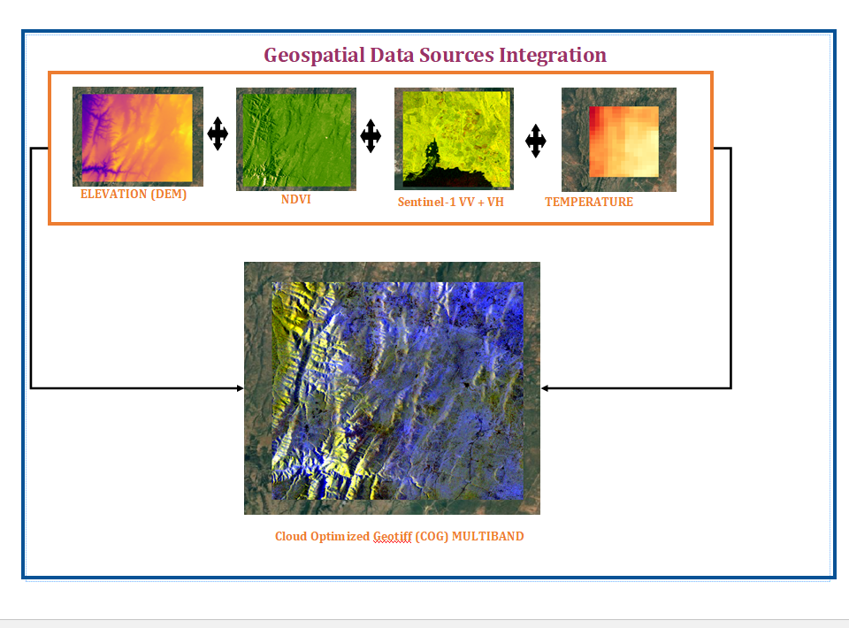

# 🌍 **Africa Environmental Datacube**



[View The Geospatial Datacube](https://drive.google.com/drive/folders/17bY5TRGLrxuMU9hKwbwlYXuThGgd_ZQ5?usp=drive_link)


## 📌 Overview

This project creates a **multi-source environmental datacube** using remote sensing data from Sentinel-1, Sentinel-2, temperature, and elevation datasets. The datacube is optimized and published as a **SpatioTemporal Asset Catalog (STAC)** to enable efficient querying and access through APIs.

---

## 💂️ Environment Setup

### **1⃣ Clone the Repository**

```bash
git clone https://github.com/Odero54/amini_technicaal_assignment.git
cd amini_technical_assignment
```

### **2⃣ Create Conda Environment** (Recommended)

```bash
conda env create -f environment.yml
conda activate geospatial_env
```

### ☆☆\*\*3⃣ Alternative: Install Using ☆☆\`\` (Only for Pip Packages)

```bash
pip install -r requirements.txt
```

---

## 👤 Project Structure

```
├── data/
│   ├── downloaded/                # Raw datasets (Sentinel, Temperature, Elevation)
│   ├── output/                     # Processed datacube and STAC catalog
│       ├── optimized_datacube.zarr
│       ├── stac_catalog/
├── notebooks/                      # Jupyter notebooks for step-by-step workflow
├── scripts/                         # Python scripts for automation/work in progress
├── .gitignore                       # Ignore large files, cache, etc.
├── environment.yml                   # Conda environment dependencies
├── requirements.txt                  # Python dependencies (pip-only)
├── README.md                         # Documentation file
├── docs/
│   ├── geospatial_data_integration.png         # Workflow flowchart image
```

---

## 📊 Workflow


```plaintext
+---------------------+
|  Download Data      |
| (Sentinel-1, 2,    |
| Temperature, DEM)  |
+---------+---------+
          |
          v
+---------------------+
|  Preprocess Data   |
| Resample to NDVI   |
| resolution         |
+---------+---------+
          |
          v
+---------------------+
|  Create Datacube   |
| Merge & reproject  |
| Save as Zarr/NC   |
+---------+---------+
          |
          v
+---------------------+
| Generate STAC      |
| Metadata & Assets  |
+---------+---------+
          |
          v
+---------------------+
| Publish to STAC    |
| API for Access     |
+---------------------+
```

### **1⃣ Preprocess Data**

- Loads Sentinel-1 (VV, VH), Sentinel-2 NDVI, temperature, and elevation data.
- Resamples all datasets to the highest resolution available (NDVI).

📌 **Run:**

```bash
python scripts/preprocess_data.py
```

### **2⃣ Create and Optimize Datacube**

- Merges datasets into a **multi-band datacube**.
- Assigns CRS (EPSG:4326) and transforms it.
- Saves in **Zarr** and **NetCDF** formats.

📌 **Run:**

```bash
python scripts/create_datacube.py
```

### **3⃣ Generate and Publish STAC Catalog**

- Converts the datacube into **STAC-compliant format**.
- Creates metadata and assets for easy API access.

📌 **Run:**

```bash
python scripts/generate_stac_catalog.py
```

---

## 🌍 Data Sources

- **Sentinel-1 (VV, VH):** Synthetic Aperture Radar (SAR) imagery.
- **Sentinel-2 NDVI:** Normalized Difference Vegetation Index (NDVI).
- **Temperature Data:** Land surface temperature dataset.
- **Elevation:** Digital Elevation Model (DEM).

---

## 🔗 STAC API Access

Once the catalog is created, you can query the STAC API using:

```bash
stac-client search --collection africa-environmental-datacube
```

Or use Python:

```python
import pystac_client
api = pystac_client.Client.open("path/to/stac_catalog/catalog.json")
items = api.search(collections=["africa-environmental-datacube"]).items()
```

---

## 🚀 Future Improvements

- Host the STAC catalog online.
- Enable real-time updates with new remote sensing data.

---